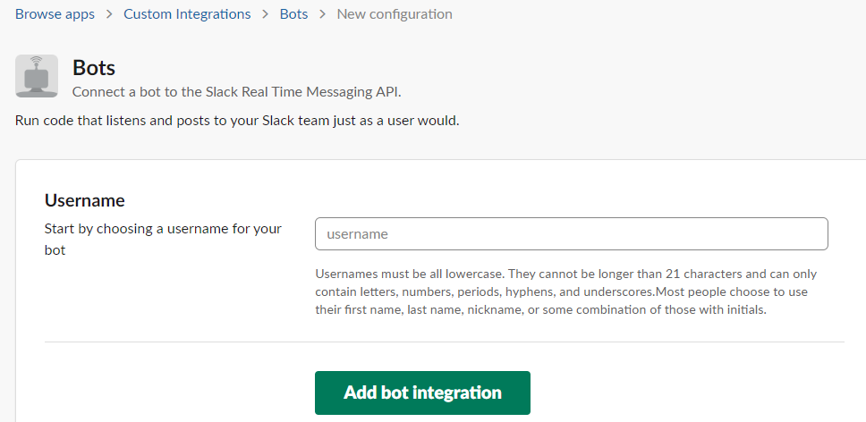
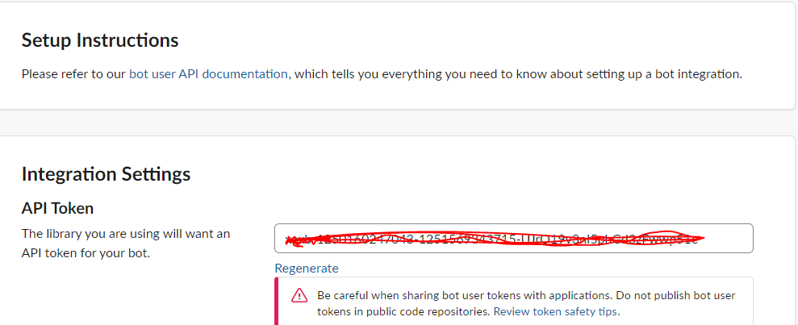
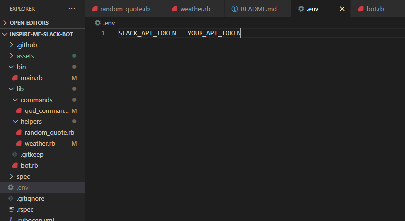
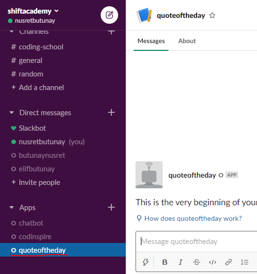

<h3 align="center">Inspire Me Slack Bot</h3>

## 📝 Content

<a href="#about">About</a>&nbsp;&nbsp;&nbsp;|&nbsp;&nbsp;&nbsp;
<a href="#installing">Installation</a>&nbsp;&nbsp;&nbsp;|&nbsp;&nbsp;&nbsp;
<a href="#usage">Test and Usage</a>&nbsp;&nbsp;&nbsp;|&nbsp;&nbsp;&nbsp;
<a href="#built_using">Built with</a>&nbsp;&nbsp;&nbsp;|&nbsp;&nbsp;&nbsp;
<a href="#authors">Authors</a>

## 🧐 About 

This project is a slack bot that responds to certain commands such as quote of the day, time, date.

## 🔧 Built with

- [Ruby](https://www.ruby-lang.org/)

### 🛠 Installing 

To get a local copy of the repository please run the following commands on your terminal:

$ cd <folder>
$ git clone https://github.com/nusretbutunay/inspire-me-slack-bot.git

## How to test and use 

Before or after cloning the repo to your local disk, follow to steps:

1. Create a Slack workspace if you don't have one already.
2. Go to https://slack.com/services/new/bot

   

3. Create a username for your bot. Click 'Add Bot Integration'
4. Copy your API Token shown on the screen.

   

5. Create a new file called <code>.env</code> in the root directory of the cloned project.
6. Enter in your API Token in the <code>.env</code> file.

   

7. Make sure to run <code>bundle install</code> in your terminal.
8. Open your slack workspace and locate the bot app you created earlier.

   

9. In your terminal, run <code>rackup</code> command.
10. After seeing, 'successfully connected team {your slack workspace} message on the terminal, go to your slack channel to test.
11. You will see a green dot next to your bot name indicating it is now active unless there is any connection error.
12. You may now use the commands provided.

## Bot Commands

    # hi                    => greets you with Hi!
    # qod                   => Sends you a random quote of the day
    # time                  => Tells you the current local time
    # date                  => Tells you the current date
    # picsum                => Generates a random image that is 200x300
    # weather <cityname>    => Tells you the weather information for the given city

## APIs Used

 - Weather: https://openweathermap.org/api
 - Quotes: https://type.fit/api/quotes
 - Pictures: https://picsum.photos/

## Gems Used

    # gem 'addressable'
    # gem 'async-websocket', '~>0.8.0'
    # gem 'celluloid-io'
    # gem 'dotenv'
    # gem 'faraday'
    # gem 'puma'
    # gem 'rack'
    # gem 'rubocop', '~>0.81.0'
    # gem 'slack-ruby-bot'

## Author(s)

👤 **Nusret**

- Github: [@Nusret](https://github.com/nusretbutunay)

- Twitter: [@Nusret](https://twitter.com/nusretbutunay)

- Linkedin: [Nusret Butunay](https://www.linkedin.com/in/nusretbutunay)

## �� Contributing

Contributions, issues and feature requests are welcome!

## Show your support

Give a ⭐️ if you like this project!

## Acknowledgments

- Microverse https://www.microverse.org/
- Weather API: https://openweathermap.org/api
- Quotes API: https://type.fit/api/quotes
- Pictures API: https://picsum.photos/
